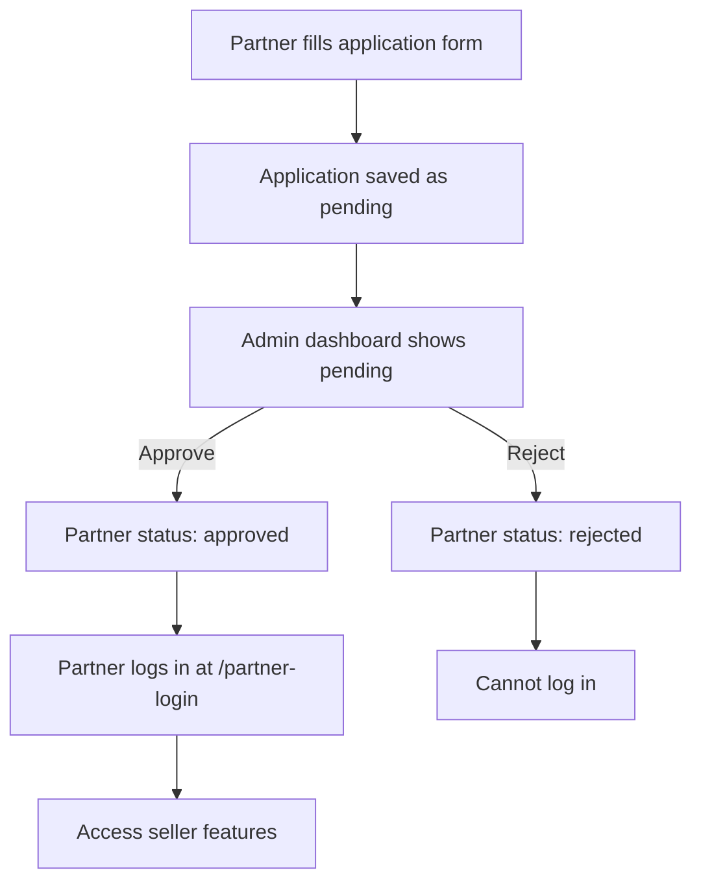
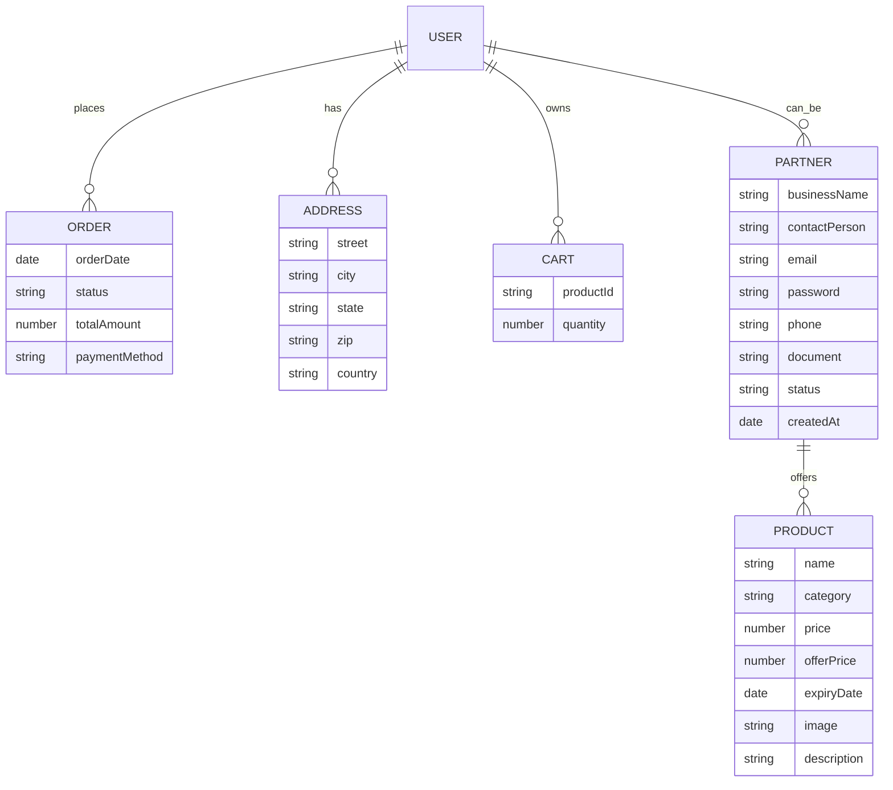

# Admin Login Instructions

To log in as admin:

1. Go to `/admin-login` in your frontend app.
2. Use the default credentials:
  - **Email:** `admin@freshbasket.com`
  - **Password:** `admin123`

If you get a 401 Unauthorized error:
- Make sure you are using the correct email and password.
- You can change the admin credentials by setting `ADMIN_EMAIL` and `ADMIN_PASSWORD_HASH` in your backend environment variables.
- Restart the backend server after changing environment variables.

For production, use a secure password and store the hash in environment variables or a database.
# Fresh Basket Project

## Overview
Fresh Basket is a full-stack food delivery and partner management platform. It includes:
- A React frontend (Vite, TailwindCSS)
- A Node.js/Express backend (MongoDB, Mongoose)
- Admin dashboard for partner approvals
- Partner application and login system

---

## Project Structure

```
frontend/
  fresh_food/
    src/
      companyPages/
        PartnerApply.jsx         # Partner application form
        PartnerLogin.jsx         # Partner login page
        PartnerAdminDashboard.jsx# Admin dashboard for approvals
        Partners.jsx             # Display approved partners
      components/
        Navbar.jsx               # Navigation bar
      context/
        AppContext.jsx           # Global app state
      App.jsx                    # Main app routes
backend/
  Fresh_server/
    models/
      Partner.model.js          # Partner schema
    controller/
      partner.auth.controller.js# Partner auth logic
      seller.controller.js       # Seller/admin logic
    routes/
      partner.routes.js         # Partner API endpoints
      seller.routes.js          # Seller/admin API endpoints
    config/
      connectDB.js              # MongoDB connection
```

---

## Flow Diagram



---

## Partner Approval & Login Flow (Text Diagram)

Partner fills form ──► Application saved (pending)
                          │
                          ▼
                Admin dashboard shows pending
                          │
        ┌───────────── Approve ──────────────┐
        ▼                                   ▼
Partner status: approved           Partner status: rejected
        │                                   │
        ▼                                   ▼
Partner logs in at /partner-login      Cannot log in
        │
        ▼
Access seller features

---

## Feature Explanation

### Partner Application
- Partners apply via `PartnerApply.jsx`.
- Data saved in MongoDB with status "pending".

### Admin Approval
- Admin reviews applications in `PartnerAdminDashboard.jsx`.
- Approves or rejects via dashboard UI.
- Status updated in MongoDB.

### Partner Login
- Only approved partners can log in via `PartnerLogin.jsx`.
- Backend checks approval and credentials.
- On success, partner gets seller access.

### Seller/Admin Features
- Seller routes protected by JWT token in cookies.
- Admin dashboard at `/admin/partners` for approvals.

---

## How to Run
1. Start backend: `npm run dev` in `Fresh_server`
2. Start frontend: `npm run dev` in `fresh_food`
3. Access frontend at `http://localhost:5173`
4. Admin dashboard: `/admin/partners`
5. Partner login: `/partner-login`

---

## API Endpoints
- `POST /api/partners/apply` — Partner application
- `GET /api/partners/pending` — Admin: view pending
- `PATCH /api/partners/:id` — Admin: approve/reject
- `POST /api/partners/login` — Partner login
- `GET /api/partners/approved` — List approved partners

## Technologies Used
- React, Vite, TailwindCSS
- Node.js, Express, MongoDB, Mongoose
- JWT authentication
- Multer for file uploads

## Contributors
- Rohit Vishwakarma (Owner)

## Entity Relationship Diagram (ERD)




## Entity Relationship Diagram (Text)

USER
  ├─ places (one-to-many) ──► ORDER
  ├─ has (one-to-many) ──► ADDRESS
  ├─ owns (one-to-many) ──► CART
  ├─ can_be (one-to-one) ──► PARTNER

PARTNER
  ├─ offers (one-to-many) ──► PRODUCT
  ├─ Fields: businessName, contactPerson, email, password, phone, document, status, createdAt
  ├─ can_be (one-to-one) ◄── USER

PRODUCT
  ├─ offered_by (many-to-one) ◄── PARTNER
  ├─ Fields: name, category, price, offerPrice, expiryDate, image, description
  ├─ in_cart (many-to-many) ◄── CART

ORDER
  ├─ placed_by (many-to-one) ◄── USER
  ├─ Fields: orderDate, status, totalAmount, paymentMethod

ADDRESS
  ├─ belongs_to (many-to-one) ◄── USER
  ├─ Fields: street, city, state, zip, country

CART
  ├─ belongs_to (many-to-one) ◄── USER
  ├─ contains (many-to-many) ──► PRODUCT
  ├─ Fields: productId, quantity

---

## Entity Relationship Flow (Text Diagram)

USER ──► fills form ──► PARTNER (pending)
                          │
                          ▼
                reviewed by ──► ADMIN DASHBOARD
                          │
        ┌───────────── Approve ──────────────┐
        ▼                                   ▼
PARTNER (approved)                  PARTNER (rejected)
        │                                   │
        ▼                                   ▼
logs in at /partner-login         Cannot log in
        │
        ▼
Accesses SELLER FEATURES (PRODUCT, ORDER, CART)
        │
        ▼
PRODUCTS offered by PARTNER
        │
        ▼
ORDERS placed by USER
        │
        ▼
CART contains PRODUCTS
        │
        ▼
ADDRESS belongs to USER

---

## Files Workflow & Interconnection

- **PartnerApply.jsx**: Partner fills out the application form. Data is sent to backend and saved as pending.
- **PartnerAdminDashboard.jsx**: Admin reviews pending applications, approves or rejects them. Status is updated in MongoDB.
- **PartnerLogin.jsx**: Only approved partners can log in. Backend checks approval and credentials.
- **Partners.jsx**: Displays all approved partners to users.
- **AppContext.jsx**: Manages global state, authentication, and navigation between pages.
- **Navbar.jsx**: Navigation bar, links to all major pages including partner login and admin dashboard.
- **App.jsx**: Main routing file, connects all pages and controls navigation.
- **SellerLogin.jsx / SellerLayout.jsx / AddProduct.jsx / ProductList.jsx / Orders.jsx**: Seller/admin features, only accessible after login.
- **Backend (Fresh_server)**: Handles all API requests, authentication, partner approval, and data storage.

### Workflow Example
1. PartnerApply.jsx → PartnerAdminDashboard.jsx → PartnerLogin.jsx → Seller features
2. AppContext.jsx & Navbar.jsx connect all pages and manage navigation/authentication
3. Backend routes and controllers handle all business logic and data updates

---
