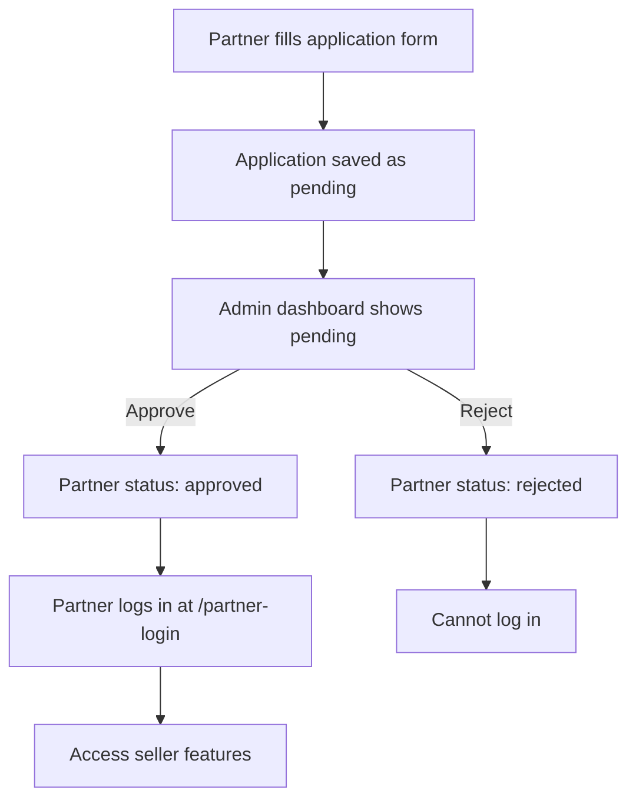
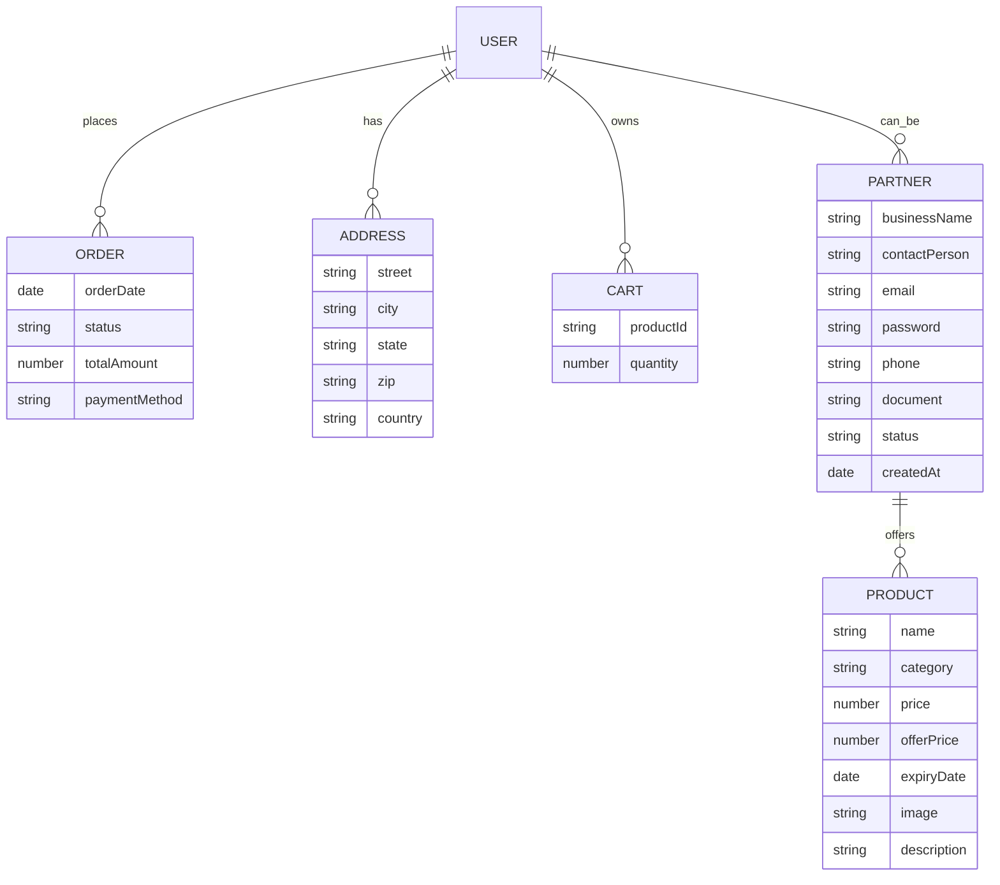

# Fresh Basket Project

## Overview

Fresh Basket is a full-stack food delivery and partner management platform.  
It features:
- A React frontend (Vite, TailwindCSS)
- Node.js/Express backend (MongoDB, Mongoose)
- Admin dashboard for partner approvals
- Partner application and login system

---

## Project Structure

```
frontend/
  fresh_food/
    src/
      companyPages/
        PartnerApply.jsx         # Partner application form
        PartnerLogin.jsx         # Partner login page
        PartnerAdminDashboard.jsx# Admin dashboard for approvals
        Partners.jsx             # Display approved partners
      components/
        Navbar.jsx               # Navigation bar
      context/
        AppContext.jsx           # Global app state
      App.jsx                    # Main app routes
backend/
  Fresh_server/
    models/
      Partner.model.js          # Partner schema
    controller/
      partner.auth.controller.js# Partner auth logic
      seller.controller.js       # Seller/admin logic
    routes/
      partner.routes.js         # Partner API endpoints
      seller.routes.js          # Seller/admin API endpoints
    config/
      connectDB.js              # MongoDB connection
```

---

## Flow Diagram



---

## Entity Relationship Diagram (ERD)



---

## Feature Explanation

### Partner Application
- Partners apply via `PartnerApply.jsx`.
- Data saved in MongoDB with status "pending".

### Admin Approval
- Admin reviews applications in `PartnerAdminDashboard.jsx`.
- Approves or rejects via dashboard UI.
- Status updated in MongoDB.

### Partner Login
- Only approved partners can log in via `PartnerLogin.jsx`.
- Backend checks approval and credentials.
- On success, partner gets seller access.

### Seller/Admin Features
- Seller routes protected by JWT token in cookies.
- Admin dashboard at `/admin/partners` for approvals.

---

## Files Workflow & Interconnection

- **PartnerApply.jsx**: Partner fills out the application form. Data is sent to backend and saved as pending.
- **PartnerAdminDashboard.jsx**: Admin reviews pending applications, approves or rejects them. Status is updated in MongoDB.
- **PartnerLogin.jsx**: Only approved partners can log in. Backend checks approval and credentials.
- **Partners.jsx**: Displays all approved partners to users.
- **AppContext.jsx**: Manages global state, authentication, and navigation between pages.
- **Navbar.jsx**: Navigation bar, links to all major pages including partner login and admin dashboard.
- **App.jsx**: Main routing file, connects all pages and controls navigation.
- **SellerLogin.jsx / SellerLayout.jsx / AddProduct.jsx / ProductList.jsx / Orders.jsx**: Seller/admin features, only accessible after login.
- **Backend (Fresh_server)**: Handles all API requests, authentication, partner approval, and data storage.

### Workflow Example

1. PartnerApply.jsx → PartnerAdminDashboard.jsx → PartnerLogin.jsx → Seller features
2. AppContext.jsx & Navbar.jsx connect all pages and manage navigation/authentication
3. Backend routes and controllers handle all business logic and data updates

---

## API Endpoints

- `POST /api/partners/apply` — Partner application
- `GET /api/partners/pending` — Admin: view pending
- `PATCH /api/partners/:id` — Admin: approve/reject
- `POST /api/partners/login` — Partner login
- `GET /api/partners/approved` — List approved partners

---

## Technologies Used

- React, Vite, TailwindCSS
- Node.js, Express, MongoDB, Mongoose
- JWT authentication
- Multer for file uploads

---

## How to Run

1. Start backend: `npm run dev` in `Fresh_server`
2. Start frontend: `npm run dev` in `fresh_food`
3. Access frontend at `http://localhost:5173`
4. Admin dashboard: `/admin/partners`
5. Partner login: `/partner-login`

---

## Contributors

- Rohit Vishwakarma (Owner)

---
